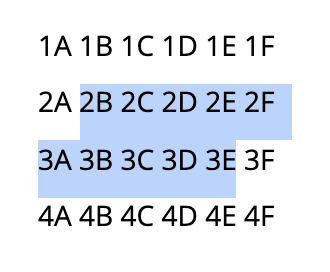

# Selections: Terminologies and How They Work

When working with and talking about selections the terminologies are, unfortunately, often used interchangeably. An imprecise language leads to imprecise specifications which in turn leads to imprecise implementations. This document aims to help clear up the terms.

## Essential Terms

To begin with, the essential terms are:

* **Selection**: The highlighted identification of a range of content.
* **Start**: The beginning of a given selection.
* **End**: The end of a given selection.
* **Anchor**: The place where a selection originated.
* **Focus**: The place where selection ended.
* **Caret**: The insertion point inside a text editor.

## What Is a Selection

Or, [as formulated on Wikipedia](https://en.wikipedia.org/wiki/Selection_(user_interface)):

> a list of items on which user operations will take place.

## Anchor/Focus Vs. Start/End

At first glance, anchor/focus might just look like a slightly more fancy way of talking about start/end. However, these two sets of terms are not to be confused. Depending on the direction of the selection, the anchor may be situated at the start or at the end of a selection (with the focus on the opposite end).

Look at the following text selection:

The selection starts before "2B" and ends after "3E". This can be directly read from looking at the selection. You might then be tempted to suggest that the anchor is before "2B" and the focus is after "3E" as well. However, this is impossible to deduce without knowing how the selection was created. If the selection was created from top to bottom, anchor and focus would line up with start and end, but if the selection was created from bottom to top, anchor and focus would be reversed. The focus can thus be either before "2B" or after "3E" depending on the selection direction.

## The Use of Anchor/Focus

Simply knowing the start/end of a selection isn't enough to derive the anchor/focus. This is only true the other way around. Given a piece of content and a selection anchor/focus pair it's possible to derive the selection start and end.

Misc. characters:

←
↑
→
↓

References:

* https://en.wikipedia.org/wiki/Selection_(user_interface)
* https://developer.mozilla.org/en-US/docs/Glossary/caret
* https://en.wikipedia.org/wiki/Cursor_(user_interface)
* https://www.w3.org/WAI/UA/UAAG10/glossary.html#def-selection
* https://developer.mozilla.org/en-US/docs/Web/API/Selection
